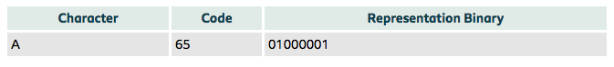
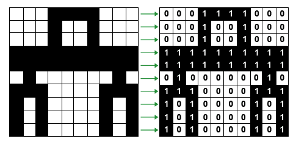

# Data Representation

## Binary
Binary is another type of number system. It consits of 1s and 0s. Where as we use a number system called denery which has numbers 0-9.

The below video describes how the binary number system works.

<iframe width="560" height="315" src="https://www.youtube.com/embed/LpuPe81bc2w" frameborder="0" allow="autoplay; encrypted-media" allowfullscreen></iframe>

## ASCII - American Standard Code for Information Interchange
ASCII stands for the American Code for Information Interchange. This code gives each character a specific binary number. [This page](https://www.ascii-code.com/) has all of the ASCII codes on it.

### Example

## Bitmapped graphics
A bit mapped graphic is an array of pixels. The total number of pixels in an image depends on the resoltion of the screen and it depends on the number of colours that can be used which is determined by the bit depth.

For example, in this image a white pixel is stored as `0` and a black pixel is tored as `1`.

There are 64 pixels in total in the above image. Each pixel is stored using a single bit. However, if the image was coloured it would need to store more than one bit per pixel. The more bits you allocate to each pizel, the larger the image file size.

Bit depth is used to describe the number of bits used to store each pixel in an image.

**Credit for Images: BBC Bitesize**