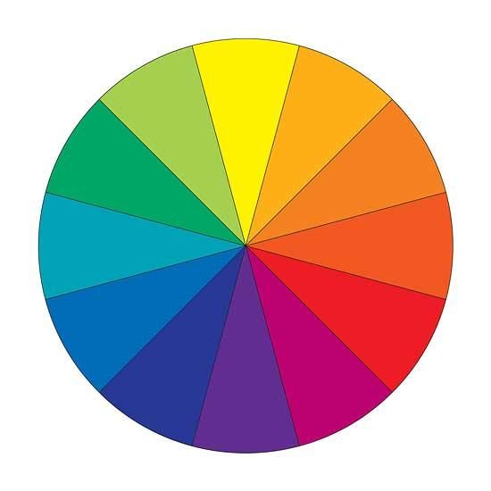
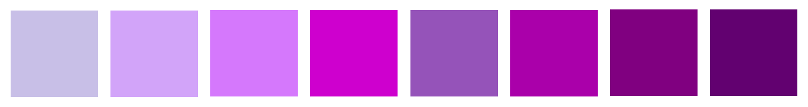
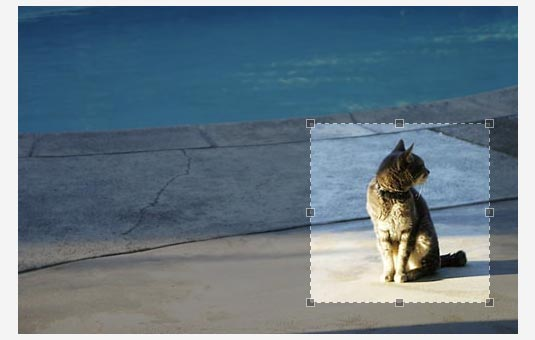
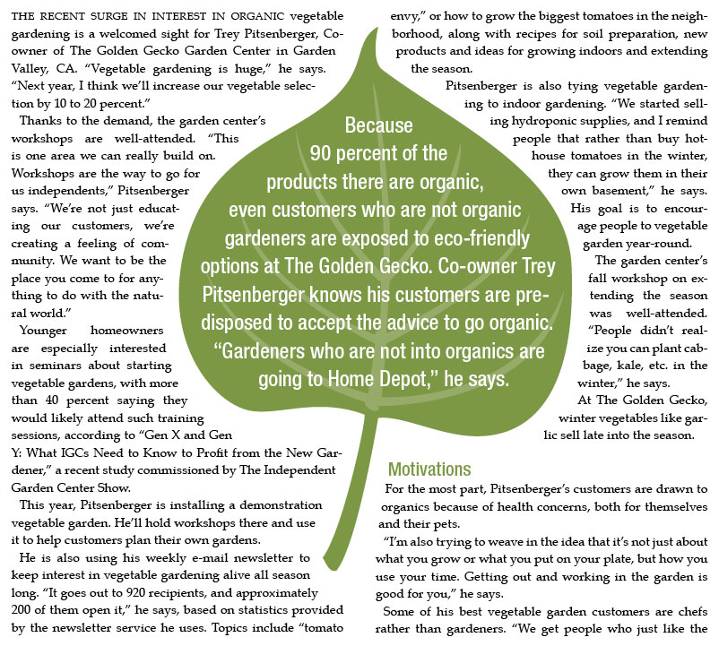

# British Standards - including third angle projection, dimensioning, line types and use of simple scale.

## Drawing Symbols
This symbol is the third angle projection symbol. It is found on all orthographic drawings, which are drawn using British Standards.

## Orthographic Drawing
An orthographic drawing is drawn using the British Standards and is laid out like shown below. The Plan is always aligned above the elevation. The End Elevations are always aligned to the right or left of the Elevation as shown.

## Dimensions
Dimensions on a British Standard drawing look like this,

**Image Coming Soon**

Notice how the dimensions are always in millimetres? There is no need to add the 'mm' after writing the number. Numbers are always written above the dimension line.

Notice that the radius dimensions are preceded by capital **R** and diameter dimensions by the diameter symbol Ø.

# Colours

## Colour Wheel

**Primary** Colours: Red, Blue and Yellow are the three primary colours.

**Secondary** Colours: These are produced by mixing together two primary colours.

* Red + Yellow = Orange
* Blue + Red = Violet
* Yellow + Blue = Green

**Tertiary** Colours: These are produced by mixing a secondary colour with a primary colour. For example:

* Yellow + Orange = Yellowy Orange
* Red + Violet = Reddy Violet
* Blue + Green = Bluey Green

Colours which are close to or next to each other on the colour wheel are said to be in harmony because they harmonise with each other. They are harmonious.

Colours which are opposite to each other on the colour wheel are said to be complimentary. They are contrasting colours.

**Warm colours** such as reds, yellows and oranges are also known to as **Advancing colours** because they appear to be closer to the viewer than other colours. A room painted in these colours would seem warm but also feel smaller because warm colours make the walls feel closer.

**Cold colours** such as blues, greens and violets have exactly the opposite effect. They appear to be further away and are also known as **Receding colours**. A room painted in these colours would appear cold, but also feel bigger as these colours make the walls look more distant.

## Colour Theory

* **Red** - great power of attraction, but too much can be tiring. Bold, warm, exciting, festive, passionate, positive. Red can be associated with rage, aggression, danger, courage, masculinity and speed.
* **Orange** - sunny, cheerful and happy. Orange is one of the appetite colours associated with flavour and energy.
* **Yellow** - The colour which is most easily seen luminous. Bright, pleasant, happy, sunny, lively and cheerful. Yellow is often associated with holidays and sunshine.
* **Green** - Green is the most restful of all the colours. Fresh, youthful, cool, quiet, soothing, natural and informal. It is also associated with safety, health and environmental concerns.
* **Blue** - Blue is more formal than red or yellow. Cool, sophisticated, serene, passive, elegant and reliable. Rarely used in food due to it's association with mould.
* **Violet** - cool, negative, retiring, subdued and solemn. Violet is associated with peacefulness.
* **Purple** - Purple combines the courage of red and the nobility of blue. Rich, pompous, impressive and regal. Purple is also seen as the colour preferred by moody people.
* **Brown** - safe, reliable, wholesome and natural. Brown is often associated with the earth.
* **Grey** - neutral, sedate, restful, dignified, dull and inconspicuous. Grey if often associated with old age.
* **White** - luminous, positive, light, delicate, cold and clean. White is often associated with innocence and purity.
* **Black** - subdued, solemn, heavy, profound. Black is often associated with death, sorrow and evil.

### Tone
The term 'tone' describes lighter or darker versions of the same colour.

### Tint
A lighter tone is a 'tint' (a colour mixed with white).

### Shade
Shade is a darker tone of a colour (a colour mixed with black).

# DPT - Desktop Publishing

## Desktop Publishing Tools

### Cropping

 
Cropping is a tool which allows you to delete unwanted parts of an image. You can crop an image by pulling in the sides or by cropping around the outline of the shape as shown in the second cropped image.

### Transparency

When you make an image/text/block of colour etc. 'see-through' so that you can see anything positioned behind it.

### Text Wrap

When you alter text to wrap around an image or shape.

### Drop Shadow

 
When you make an image/text/block of colour etc. 'see-through' so that you can see anything positioned behind it.

### Flow Text Along Path

 
This is when a line or shape is drawn and used as a path for text. You can create any shape and this can make for a more interesting design, drawing the reader in.
